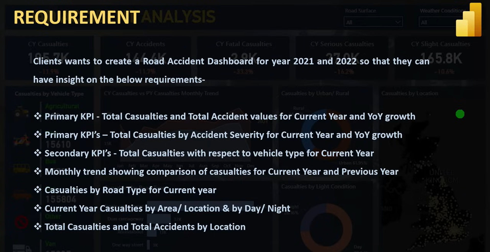
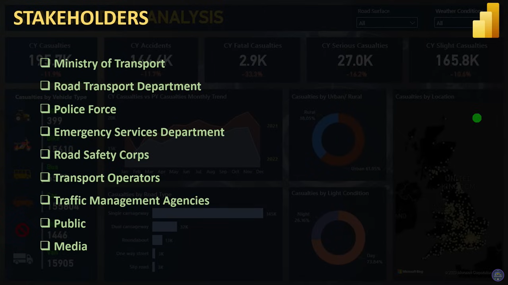
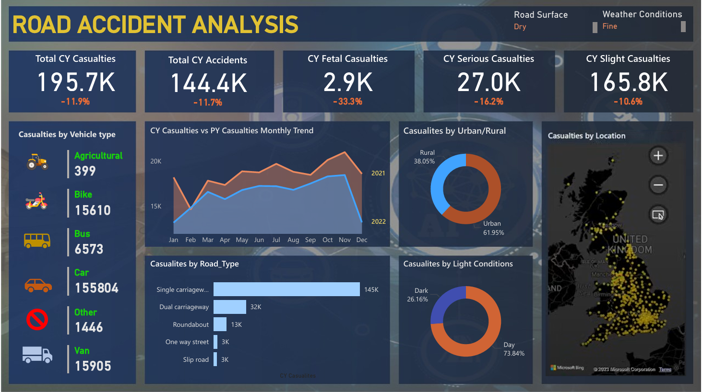

# 🚦 Road Accident Analysis Dashboard (Power BI Project)

## 📌 Project Overview
An end-to-end **Power BI project** analyzing road accidents (2019–2022).  
The goal was to clean and process raw data, build a structured data model, create insightful DAX measures, and design an interactive dashboard to support stakeholders in decision-making.

---

## 🛠 Tools & Skills
- Microsoft Power BI Desktop  
- Power Query (Data Cleaning & Preprocessing)  
- DAX (Time Intelligence: YTD, YOY)  
- Data Modeling (Star Schema)  
- Data Visualization (KPIs, Charts, Maps)  

---

## 📊 Key Insights
| KPI                | Value         |
|--------------------|---------------|
| Total Accidents    | **144.4K**    |
| Total Casualties   | **195.7K**    |
| Urban vs Rural     | **62% / 38%** |
| Day vs Night       | **74% / 26%** |
| Main Vehicle Type  | **Cars**      |

---

## 🖼 Dashboard Preview
  
  
  

---

## 📂 Files in this Repository
- `Power BI Project.pbix` → Full Power BI file  
- `Dashboard PDF` → Exported dashboard  
- `Case Study.docx` → Documentation & project steps  
- `Screenshots` → Key visuals from the dashboard  

---

## 📈 Project Workflow
1. Requirements Gathering & Stakeholder Analysis  
2. Data Cleaning with Power Query  
3. Calendar Table creation for Time Intelligence  
4. Data Modeling (relationships between Data & Calendar)  
5. DAX Measures (YTD, YOY, KPIs)  
6. Dashboard Design & Insights  

---

## 📬 Contact
Feel free to connect with me on [LinkedIn](https://www.linkedin.com/in/mohamed-talat-974163202) for feedback or collaboration.
